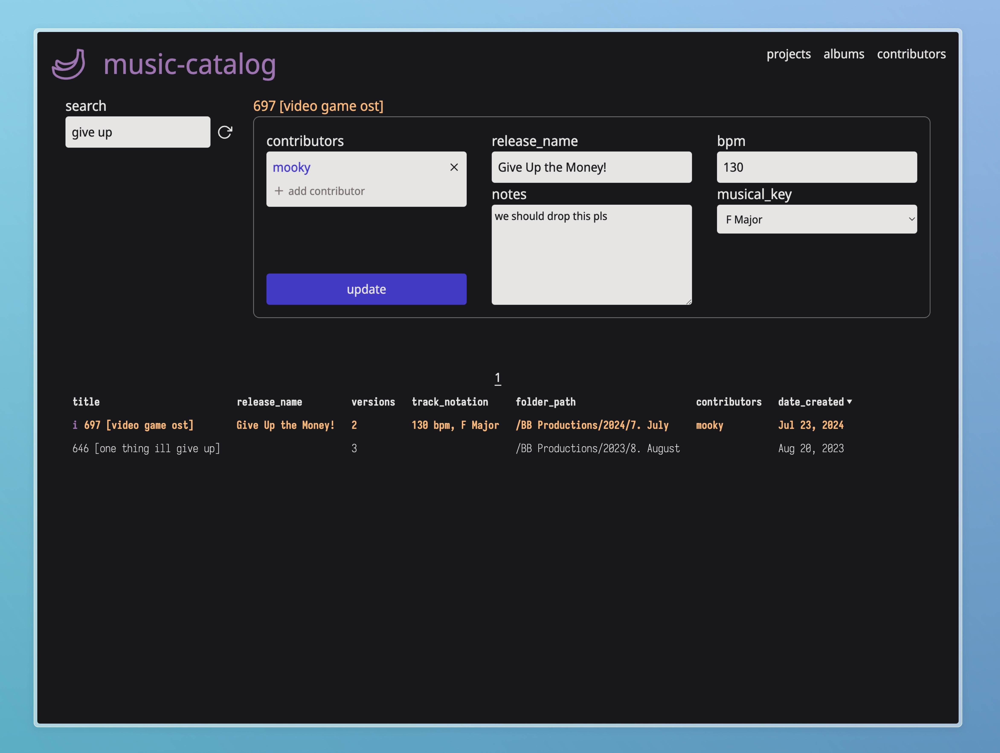

# music-catalog
## song name != ableton project name
I can never remember which of my Ableton projects is for which song. I can hear the tune in my head, but if I search my projects folder for "give up the money", I won't find "697 [video game ost]"...

**BUT NOW I CAN!**



In the backend (music-catalog-server), I can run
```
node scripts/insertData.js "~/Music/Ableton/Projects"
```
and all my worries melt away as my beautiful, normalized tables are populated with folder paths, project creation dates, and more!

## Populate projects tables
```
node scripts/insertData.js "/path/to/base/folder"
```

### I will forget these commands... so I've documented some examples here.

`npx db-migrate create add-projects`
_(`--sql-file` is set to true in database.json)_

`npm run migrate:test`
`npm run migrate:dev`

`npx db-migrate down -c 1`
_rollback 1 step_

`npx db-migrate create:seed initial_seed`

`npx db-migrate up:seed`