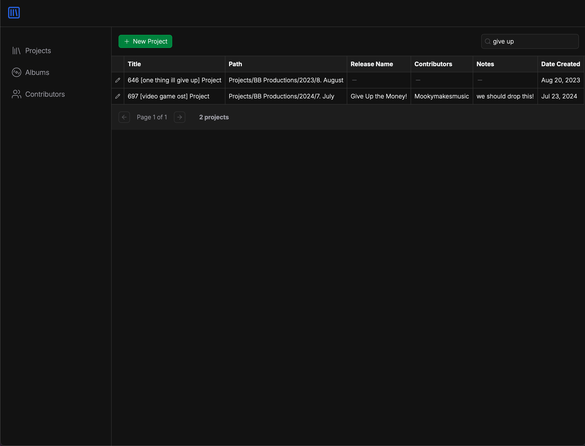

# music-catalog
## song name =/= ableton project name
I can never remember which of my Ableton projects is for which song. I can hear the tune in my head, but if I search my projects folder for "give up the money", I won't find "697 [video game ost]"...

**BUT NOW I CAN!**



In the backend (music-catalog-server), I can run
```
node scripts/insertData.js "~/Music/Ableton/Projects"
```
and all my worries melt away as my beautiful, normalized tables are populated with folder paths, project creation dates, version names, and more!